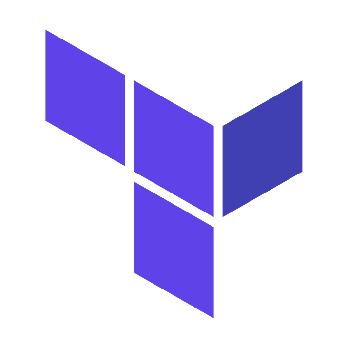

<h1 align="center"><br/>Terraform Accelerator<br/>
</h1><div align="center"><b>An opinionated, multi-cloud, multi-region, best-practice accelerator for Terraform</b></div><br/>
<br/>

Originally developed internally by the Platform Engineers at Slalom Build, based on our experience building enterprise-grade Terraform for customers. We decided to open source this accelerator to empower other engineers, encourage contributions and work more collaboratively with customers.

June 2023: We're just getting this project off the ground, and it's under heavy development. That said, the AWS modules are feature complete (subject to further improvement, of course), and are already being used for production workloads. The patterns and tools are well established, and likely won't change massively. The Azure and GCP modules are not complete, and while they're actively being worked on and contributions are welcome, they're not ready for production yet.

## 🎯 Project goals 

1. Stop re-inventing the wheel! Create a repository that can be used to quickly provision resources in AWS, Azure and GCP. The approach must be -
   1. scalable - scaling from one small group of resources in one region to many resources, in multiple accounts, in multiple regions should not be difficult or overly complex
   2. maintainable - the structure should be logical, code should be DRY and straightforward, no hacks
   3. extensible - the patterns used should enable others to a) easily extend existing code, and b) create their own implementations
   4. well-tested - no explanation required hopefully!
   5. not just our best practice - follow [Terraform best practices](https://www.terraform-best-practices.com) as closely as possible. See [naming conventions](https://www.terraform-best-practices.com/naming) and [code structure](https://www.terraform-best-practices.com/code-structure)
1. Standardize creation of the following basic resources (and more as the need is discovered), with the understanding that they will be further customized for every use case ([reference](https://cloud.google.com/free/docs/aws-azure-gcp-service-comparison)):

    | Service type | AWS | Google Cloud | Azure |
    |---|---|---|---|
    | Virtual networking| VPC | Virtual Private Cloud | Azure Virtual Network |
    | DNS | Route 53 | Cloud DNS | Azure DNS
    | Virtual machines | EC2 | Compute Engine | Azure Virtual Machines |
    | Autoscaling | AutoScaling Groups | Compute Engine AutoScaler | Azure Autoscale, Azure Virtual Machine Scale Sets |
    | Load balancing | Application Load Balancing | Cloud Load Balancing |Azure Load Balancer |
    | Auditing | CloudTrail | Cloud Audit Logs | Azure Audit Logs | 
    | Monitoring | CloudWatch | Cloud Monitoring | Azure Monitor |
    | Policy enforcement | AWS Config | Compute Resource Policy | Azure Policy |
    | Parallel task execution | SQS, SNS | Cloud Tasks | Azure Service Bus, Azure Storage Queues |
    | Terraform state storage | S3 & DynamoDB | Cloud Datastore | Azure Storage |
  
1. Create integration tests for every module we create and use
1. Create a robust CI/CD pipeline for end-to-end deployment and testing of infrastructure code
1. Build a community of maintainers and contributors for as long as the accelerator remains useful
1. Manage vulnerabilities to improve the overall security posture of solutions based on the accelerator

## 🤔 When to use the terraform accelerator (or not)

This accelerator is best suited for:

* Managing multiple environments on a medium/large/enterprise scale
* Multi-region cloud deployments
* Hybrid (multi-cloud) deployments
* Terraform automation and collaboration, to enable team autonomy and enable multiple teams to own infrastructure

When you should pass on this accelerator:

* If you need to use Terraform Cloud as a backend (atmos doesn't support it yet)
* If your terraform is very simple and likely won't grow in complexity

## 🚀 Setup

See the [Getting started](docs/GETTING-STARTED.md) docs for complete instructions on how to use this accelerator.


## 🧬 Project structure

```
.
├── .github                         # GitHub workflows and repo config
├── .vscode                         # VSCode settings
├── components                     
│   └── terraform                   # Terraform components
│       ├── aws                     
│       ├── azure                   
│       └── gcp                     
├── config                          # Atmos configuration files
│   ├── aws                         
│   │   └── atmos.yaml
│   ├── azure
│   │   └── atmos.yaml
│   └── gcp
│       └── atmos.yaml
├── docs                            # Project documentation
├── examples                        # Example configs and stacks
│   ├── config
│   └── stacks
└── stacks                          # Atmos stack configurations
    ├── aws                         # AWS stack definitions
    │   ├── automation
    │   ├── catalog                 
    │   ├── dev
    │   ├── prod
    │   └── staging
    ├── azure                       # Azure stack definitions
    │   └── dev
    └── gcp                         # GCP stack definitions
        └── dev
```

## 💬 Talk to us! 
We host a community chat every Tuesday at 11am (Vancouver/Pacific Time), where we talk about the accelerator, recent and upcoming changes, feature requests, etc. Please join us https://bit.ly/terraform-accelerator-chat

## 🫶 Contributing 
Contributions are always welcome! Fork this repository, make your changes, submit a PR. You know how it works.

## 🐛 Support 
Raise an issue via Github. Or if you're part of the Slalom Build team, contact us internally via our [#terraform-accelerator](https://slalom.slack.com/archives/C04GX9XA60P) channel.

---
## License
Copyright &copy; 2023 Slalom LLC.

Permission is hereby granted, free of charge, to any person obtaining a copy
of this software and associated documentation files (the "Software"), to deal
in the Software without restriction, including without limitation the rights
to use, copy, modify, merge, publish, distribute, sublicense, and/or sell
copies of the Software, and to permit persons to whom the Software is
furnished to do so, subject to the following conditions:

The above copyright notice and this permission notice shall be included in all
copies or substantial portions of the Software.

THE SOFTWARE IS PROVIDED "AS IS", WITHOUT WARRANTY OF ANY KIND, EXPRESS OR
IMPLIED, INCLUDING BUT NOT LIMITED TO THE WARRANTIES OF MERCHANTABILITY,
FITNESS FOR A PARTICULAR PURPOSE AND NONINFRINGEMENT. IN NO EVENT SHALL THE
AUTHORS OR COPYRIGHT HOLDERS BE LIABLE FOR ANY CLAIM, DAMAGES OR OTHER
LIABILITY, WHETHER IN AN ACTION OF CONTRACT, TORT OR OTHERWISE, ARISING FROM,
OUT OF OR IN CONNECTION WITH THE SOFTWARE OR THE USE OR OTHER DEALINGS IN THE
SOFTWARE.
