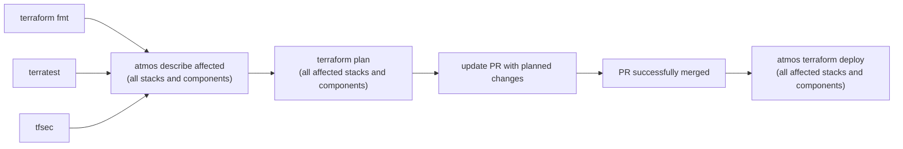

# Introducing Atmos
We use [Atmos](https://atmos.tools) to enhance Terraform's native functionality. Atmos is both a library and a command-line tool for provisioning, managing and orchestrating workflows. It's a wrapper around other tools and task runners (e.g. `make`, `terragrunt`, `terraform`, `aws cli`, `gcloud`, etc.) and its intended use is to provide a single simple CLI interface to manage clouds and clusters.

## Why use Atmos?

Terraform natively works well for clearly defining infrastructure as code, but as the infrastructure grows in size, scalability and management become complex. It becomes harder to keep code DRY and easy to understand, and there's no simple way in native Terraform to enforce good deployment patterns, general best practices, and policies when provisioning multi-account environments.

To achieve the goals of DRYness and simplicity, Atmos separates environment configuration variables and resource definitions. This allows you to provision the same base infrastructure configuration into different regions, environments and stages, and enhances module reusability.

## Components and stacks

Two key concepts of Atmos are [components](https://atmos.tools/core-concepts/components/) and  [stacks](https://atmos.tools/core-concepts/stacks/):

  * A **component** is a set of infrastructure-as-code resource definitions, analogous to a _module_ in Terraform
    * Convention: parent or root modules should be in `components/terraform/` directory and child modules in `modules/`
  * A **stack** is a YAML file that describes _both_ which components to deploy to an environment _and_ the configuration settings to apply to the components
    * The centralized stack configurations (variables for the Terraform components) are in the `stacks/` folder.
  * When deploying resources using the `atmos` command-line tool, you specify which component to deploy and which stack to apply to it, similarly to:
    ```bash
    atmos terraform apply vpc-flow-logs-bucket-1 --stack core-ue2-dev
    ```

## Example pipeline workflow



## Example directory structure
```
.
├── .github                         ... Github Actions workflows
├── config                          ... Atmos configuration files
│   └── aws
│       ├── _defaults               ... Default variables, inherited by environment-specific deployments
│       ├── ci                      ... Environment-specific variables
│       ├── dev
│       ├── global
│       ├── shared-services
│       └── test
├── deployments                     ... Terraform files for specific applications
│   └── aws
│       ├── global
│       ├── nexus
│       ├── saas
│       └── shared-services
├── modules                         ... Terraform modules, used by applications
│   ├── aws_account_ram_share
│   ├── aws_alb
│   ├── aws_alb_attachment
│   ├── aws_alb_eks_attachment
│   ├── aws_ec2
│   ├── aws_k8s_efs
│   ├── aws_msk
│   ├── aws_rds
│   ├── aws_route53
│   ├── aws_route53_subdelegate
│   ├── terraform-aws-network
│   └── terraform-aws-region
├── scripts                         ... Miscelleanous scripts
└── terraform.tfstate.d
```

```
.
│  # Store components separately according to which IaC tool they use
├── components/
│   └── terraform/  # Root modules go here
│       ├── vpc/
│       ├── waf/
│       ├── sns/
│       ├── config/
│       └── cloudwatch/
│
│  # Configuration to apply to components
├── stacks/
│   ├── aws/
│   │    ├── _defaults.yaml
│   │    ├── global-region.yaml
│   │   └── $region.yaml
│   ├── azure/
│   └── gcp/
│      
│  # Atmos configuration file
└── atmos.yaml
```
In this example (which assumes an AWS deployment):

  * `components/` contains all resource configurations
  * `stacks/` contains all stack configurations
  * For each environment and region, there is a stack configuration file named `$environment-$region.yaml` where `$environment` is the abbreviation for an AWS region
  * `$environment/globals.yaml` contains values to use in all stages in a particular environment
    * When running `atmos` commands, the global values get merged with the `$environment/$region.yaml` configuration

For a complete `atmos.yaml`, see [the example in the CloudPosse repo](https://github.com/cloudposse/atmos/blob/master/examples/complete/atmos.yaml).

## Example: a stack defintiion

This is for deploying Terraform-defined IaC resources in the `test` environment in the `us-west-2` AWS region for a customer named `accelerator`: 
  ```yaml
  import: # Any other stack files to import and combine with this one
    - test/_defaults

  vars: # Variables to apply to all components in the stack, regardless of IaC tool
    region: us-west-2
    environment: uw2
    namespace: accelerator-test
  components: # Which components to deploy as part of this stack, regardless of IaC tool
    terraform: # Which specific IaC tool to use
      vpc: # Corresponds to the module in components/terraform/vpc/
        vars: # Which variables to apply to the Terraform VPC resource
          ipv4_primary_cidr_block: "10.0.0.0/16"
          nat_gateway_enabled: true
          availability_zones:
            - us-west-2a
            - us-west-2b
            - us-west-2c
  ```

## Example: adding a new component:

1. In `components/terraform/`, define a `vpc` module ([`example`](https://github.com/cloudposse/terraform-aws-vpc/tree/master/examples/complete)):

    

2. Modify `stacks/test/us-west-2.yaml` as below to specify variable values for the new component:

    ```yaml
    import:
      - test/_defaults

    vars:
      region: us-west-2
      environment: uw2
      namespace: accelerator-test
    components:
      terraform:
        vpc:
          vars:
            ipv4_primary_cidr_block: "10.0.0.0/16"
            nat_gateway_enabled: true
            availability_zones:
              - us-west-2a
              - us-west-2b
              - us-west-2c
    ```

3. Run `atmos terraform plan` against the VPC component:
    ```bash
    atmos terraform plan vpc --stack accelerator-test-uw2
    ```
    <details>

    <summary>
    Expand for example Terraform plan output
    </summary>

      ```bash
      Variables for the component 'vpc' in the stack 'accelerator-test-uw2':
      availability_zones:
      - us-west-2a
      - us-west-2b
      - us-west-2c
      environment: uw2
      ipv4_primary_cidr_block: 10.0.0.0/16
      namespace: accelerator-test
      nat_gateway_enabled: true
      region: us-west-2
      tags:
        business-unit: 'Slalom Build'
        component: vpc
        contact: accelerator@slalom.com
        environment: development
        expense-class: network
        product: accelerator
        map-migrated: nope
      Writing the variables to file:
      components/terraform/vpc/accelerator-test-uw2-vpc.terraform.tfvars.json
      Executing command:
      /opt/homebrew/bin/terraform init -reconfigure
      Initializing modules...
      Initializing the backend...
      Initializing provider plugins...
      - Reusing previous version of hashicorp/aws from the dependency lock file
      - Using previously-installed hashicorp/aws v4.35.0
      Terraform has been successfully initialized!
      You may now begin working with Terraform. Try running "terraform plan" to see
      any changes that are required for your infrastructure. All Terraform commands
      should now work.
      If you ever set or change modules or backend configuration for Terraform,
      rerun this command to reinitialize your working directory. If you forget, other
      commands will detect it and remind you to do so if necessary.
      Command info:
      Terraform binary: terraform
      Terraform command: apply
      Arguments and flags: []
      Component: vpc
      Stack: accelerator-test-uw2
      Working dir: components/terraform/vpc
      Executing command:
      /opt/homebrew/bin/terraform workspace select accelerator-test-uw2
      Executing command:
      /opt/homebrew/bin/terraform apply -var-file accelerator-test-uw2-vpc.terraform.tfvars.json
      Terraform used the selected providers to generate the following execution plan. Resource actions are indicated with the following symbols:
        + create
      Terraform will perform the following actions:
        # module.vpc.aws_default_security_group.default[0] will be created
        + resource "aws_default_security_group" "default" {
            + arn                    = (known after apply)
            + description            = (known after apply)
            + egress                 = (known after apply)
            + id                     = (known after apply)
            + ingress                = (known after apply)
            + name                   = (known after apply)
            + name_prefix            = (known after apply)
            + owner_id               = (known after apply)
            + revoke_rules_on_delete = false
            + tags                   = {
                + "Environment"      = "uw2"
                + "Name"             = "accelerator-test-uw2-default"
                + "Namespace"        = "accelerator-test"
                + "business-unit" = "Slalom Build"
                + "component"     = "vpc"
                + "contact"       = "accelerator@slalom.com"
                + "environment"   = "development"
                + "expense-class" = "network"
                + "product"       = "accelerator"
                + "map-migrated"     = "nope"
              }
            + tags_all               = {
                + "Environment"      = "uw2"
                + "Name"             = "accelerator-test-uw2-default"
                + "Namespace"        = "accelerator-test"
                + "business-unit" = "Slalom Build"
                + "component"     = "vpc"
                + "contact"       = "accelerator@slalom.com"
                + "environment"   = "development"
                + "expense-class" = "network"
                + "product"       = "accelerator"
                + "map-migrated"     = "nope"
              }
            + vpc_id                 = (known after apply)
          }
        # module.vpc.aws_internet_gateway.default[0] will be created
        + resource "aws_internet_gateway" "default" {
            + arn      = (known after apply)
            + id       = (known after apply)
            + owner_id = (known after apply)
            + tags     = {
                + "Environment"      = "uw2"
                + "Name"             = "accelerator-test-uw2"
                + "Namespace"        = "accelerator-test"
                + "business-unit" = "Slalom Build"
                + "component"     = "vpc"
                + "contact"       = "accelerator@slalom.com"
                + "environment"   = "development"
                + "expense-class" = "network"
                + "product"       = "accelerator"
                + "map-migrated"     = "nope"
              }
            + tags_all = {
                + "Environment"      = "uw2"
                + "Name"             = "accelerator-test-uw2"
                + "Namespace"        = "accelerator-test"
                + "business-unit" = "Slalom Build"
                + "component"     = "vpc"
                + "contact"       = "accelerator@slalom.com"
                + "environment"   = "development"
                + "expense-class" = "network"
                + "product"       = "accelerator"
                + "map-migrated"     = "nope"
              }
            + vpc_id   = (known after apply)
          }
        # module.vpc.aws_vpc.default[0] will be created
        + resource "aws_vpc" "default" {
            + arn                                  = (known after apply)
            + assign_generated_ipv6_cidr_block     = true
            + cidr_block                           = "10.0.0.0/16"
            + default_network_acl_id               = (known after apply)
            + default_route_table_id               = (known after apply)
            + default_security_group_id            = (known after apply)
            + dhcp_options_id                      = (known after apply)
            + enable_classiclink                   = false
            + enable_classiclink_dns_support       = false
            + enable_dns_hostnames                 = true
            + enable_dns_support                   = true
            + enable_network_address_usage_metrics = (known after apply)
            + id                                   = (known after apply)
            + instance_tenancy                     = "default"
            + ipv6_association_id                  = (known after apply)
            + ipv6_cidr_block                      = (known after apply)
            + ipv6_cidr_block_network_border_group = (known after apply)
            + main_route_table_id                  = (known after apply)
            + owner_id                             = (known after apply)
            + tags                                 = {
                + "Environment"      = "uw2"
                + "Name"             = "accelerator-test-uw2"
                + "Namespace"        = "accelerator-test"
                + "business-unit" = "Slalom Build"
                + "component"     = "vpc"
                + "contact"       = "accelerator@slalom.com"
                + "environment"   = "development"
                + "expense-class" = "network"
                + "product"       = "accelerator"
                + "map-migrated"     = "nope"
              }
            + tags_all                             = {
                + "Environment"      = "uw2"
                + "Name"             = "accelerator-test-uw2"
                + "Namespace"        = "accelerator-test"
                + "business-unit" = "Slalom Build"
                + "component"     = "vpc"
                + "contact"       = "accelerator@slalom.com"
                + "environment"   = "development"
                + "expense-class" = "network"
                + "product"       = "accelerator"
                + "map-migrated"     = "nope"
              }
          }
      Plan: 3 to add, 0 to change, 0 to destroy.
      Changes to Outputs:
        + vpc_id = (known after apply)
      ╷
      │ Warning: Argument is deprecated
      │
      │   with module.vpc.aws_vpc.default[0],
      │   on .terraform/modules/vpc/main.tf line 43, in resource "aws_vpc" "default":
      │   43:   enable_classiclink               = local.classiclink_enabled
      │
      │ With the retirement of EC2-Classic the enable_classiclink attribute has been deprecated and will be removed in a future version.
      │
      │ (and one more similar warning elsewhere)
      ╵
      Do you want to perform these actions in workspace "accelerator-test-uw2"?
        Terraform will perform the actions described above.
        Only 'yes' will be accepted to approve.
        Enter a value: yes
      module.vpc.aws_vpc.default[0]: Creating...
      module.vpc.aws_vpc.default[0]: Still creating... [10s elapsed]
      module.vpc.aws_vpc.default[0]: Still creating... [20s elapsed]
      module.vpc.aws_vpc.default[0]: Creation complete after 23s [id=vpc-0d57e4e5b1bcee28c]
      module.vpc.aws_internet_gateway.default[0]: Creating...
      module.vpc.aws_default_security_group.default[0]: Creating...
      module.vpc.aws_internet_gateway.default[0]: Creation complete after 0s [id=igw-0ed552bd901bb38f8]
      module.vpc.aws_default_security_group.default[0]: Creation complete after 2s [id=sg-0e85352dbfeb5145e]
      ╷
      │ Warning: Argument is deprecated
      │
      │   with module.vpc.aws_vpc.default[0],
      │   on .terraform/modules/vpc/main.tf line 43, in resource "aws_vpc" "default":
      │   43:   enable_classiclink               = local.classiclink_enabled
      │
      │ With the retirement of EC2-Classic the enable_classiclink attribute has been deprecated and will be removed in a future version.
      │
      │ (and one more similar warning elsewhere)
      ╵
      Apply complete! Resources: 3 added, 0 changed, 0 destroyed.
      Outputs:
      vpc_id = "vpc-0d57e4e5b1bcee28c"

      ```
      </details>
      </br>
  1. Confirm in the AWS console that the `vpc` component has been created:
      
